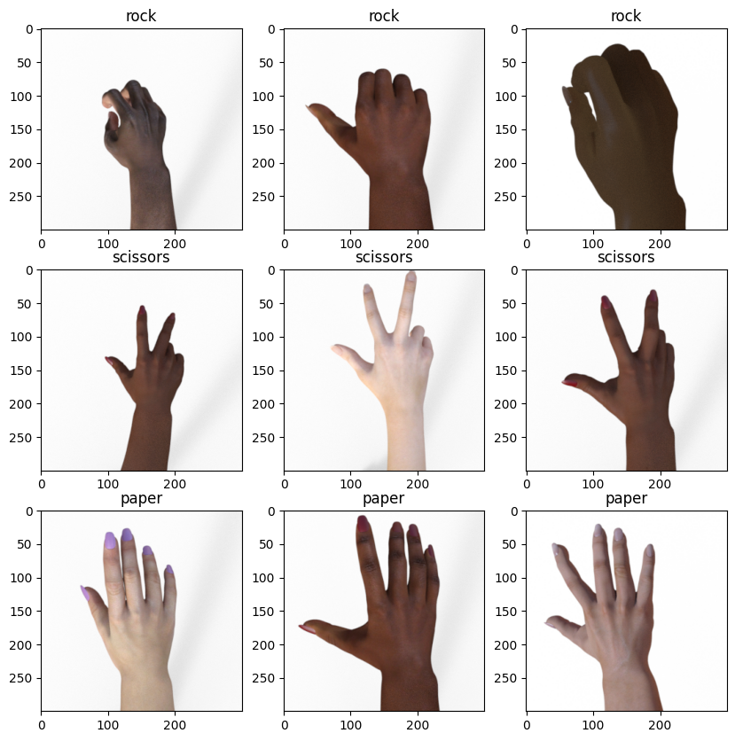

# Praktikum ML Modul 6
- Nama  : Ertha Risky Pratisca
- NIM   : 202010370311129

## Dataset
The dataset used in this project contains a total of 2520 images with an equal proportion of images per class: 840 images for rock, paper, and scissors, respectively. [The link to the dataset can be accessed here.](https://drive.google.com/file/d/1X9jFokn9AXMMVTmlBQ7XZpBsLKVFnp-d/view?usp=drive_link)

    

